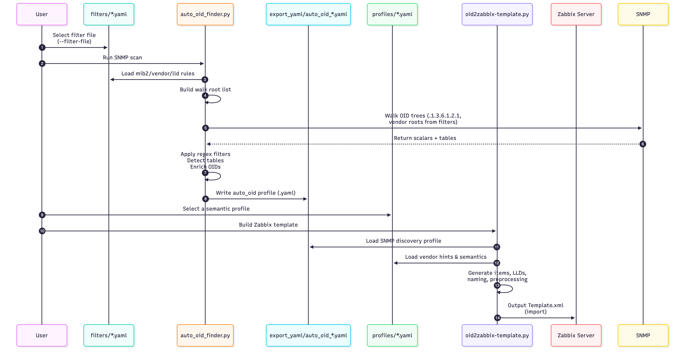

# 🚀 SNMP Auto OID Finder & Zabbix Template Builder

Smart, automated SNMP discovery and Zabbix 7.0 template generation.

This project consists of four integrated tools:

- auto_oid_finder.py — Smart SNMP scanner and YAML profile generator
- oid2zabbix-template.py — Zabbix 7 template builder
- fixmymib.py — Vendor MIB fixer/normalizer
- mib2oid.py — MIB → OID extractor

---

## 📦 Requirements

Python packages:

    pip install pyyaml rich lxml

Optional (recommended):

    pip install pysmi

System tools:

- snmpwalk
- snmptranslate
  (from net-snmp)

Optional:

- Observium MIB repository (auto-managed in ./observium_mibs)

---

## 📁 Directory Structure

    auto_oid_finder.py               # SNMP scanner
    oid2zabbix-template.py           # Template builder
    archive/fixmymib.py                      # MIB fixer
    archive/mib2oid.py                       # MIB → OID extractor

    filters/                         # Device-specific scanner rules
      filters.yaml                   # Generic filters
      filters_qnap.yaml              # Example vendor filters

    archive/profiles/                        # Zabbix semantic profiles
      profile_55062_QNAP.yaml
      profile_24681_QNAP.yaml

    export_yaml/                     # Scanner output
    export_template/                 # Zabbix templates
    observium_mibs/                  # Optional MIB repo (auto-managed)

---

## 🛰️ auto_oid_finder.py — SNMP Scanner & Profile Generator

auto_oid_finder.py scans a device via SNMP and generates a compact YAML profile with:

- Discovered scalar OIDs
- Detected SNMP tables
- LLD-ready table metadata
- Sample type/value information
- MIB-enriched module/name/description (optional)
- Selection flags based on filters

### Command-line options

    usage: auto_oid_finder.py [options]

    Required:
      --host <IP/FQDN>              Target device

    SNMP:
      --community <string>          SNMP v2c community
      --port <port>                 SNMP port (default: 161)
      --timeout <s>                 SNMP timeout (default: 2)
      --retries <n>                 SNMP retries (default: 1)

    Discovery:
      --filter-file <yaml>          Filtering rules (default: filters/filters.yaml)
      --root <OID>                  Extra OID root to walk (repeatable)
      --no-filter                   Disable filters; select everything

    Output:
      --output <file>               Output YAML file
      --no-observium                Disable Observium/MIB enrichment
      --observium-sync              Force Observium MIB repo sync/update

    Misc:
      --debug                       Enable verbose debug logging
      --version                     Show script version and exit

### Behaviour (v1.0.15)

Walk roots:

- Always walks:
  - .1.3.6.1.2.1 (MIB-2)
- Additionally walks:
  - Any lld.include_roots from the filter file that start with .1.3.6.1.4.1.
    (e.g. .1.3.6.1.4.1.24681, .1.3.6.1.4.1.55062 for QNAP)
  - Any extra roots passed via --root

Important:

- It no longer walks the entire .1.3.6.1.4.1 enterprises tree by default.
- SNMP walks that partially succeed but end in a timeout still contribute their data.
  - Partial results are kept and logged as warnings instead of hard errors.

### Schema overview


### Sequence overview



---

## 🧩 oid2zabbix-template.py — Zabbix Template Builder

oid2zabbix-template.py reads the YAML profile generated by auto_oid_finder.py and converts it into a Zabbix 7.0 template:

- Scalar items
- LLD discovery rules
- Item prototypes
- Async SNMP keys (snmp.get[] / snmp.walk[])
- Preprocessing chains
- Vendor/metadata injection
- Clean naming and deduplication

### Command-line options

    usage: oid2zabbix-template.py <profile.yaml> [options]

    Options:
      --name <template name>        Name of the Zabbix template
      --vendor <string>             Vendor override
      --prefix <string>             Prefix all item names
      --output-dir <dir>            Output directory (default: export_template/)
      --skip-lld                    Disable low-level discovery
      --skip-scalars                Do not include scalar items
      --debug                       Enable verbose debugging

Profiles in profiles/ provide semantic hints:

- profile_55062_QNAP.yaml
- profile_24681_QNAP.yaml
- etc.

They map discovered OIDs to semantic groups such as disk, fan, temp, etc. per vendor or enterprise ID.

---

## ⚡ Quickstart

### 1) Install requirements

    pip install pyyaml rich lxml pysmi
    sudo apt install snmp

---

### 2) Choose a filter file

Generic scanning:

    filters/filters.yaml

Vendor-specific example (QNAP):

    filters/filters_qnap.yaml

A typical QNAP filter file includes:

- MIB-2 and vendor scalar regex patterns
- LLD regex
- LLD include_roots:
  - .1.3.6.1.2.1.2.2
  - .1.3.6.1.2.1.31.1.1
  - .1.3.6.1.4.1.24681
  - .1.3.6.1.4.1.55062
- LLD exclude_roots:
  - Routing, ARP, TCP connection tables
  - HR-MIB junk tables
  - QNAP directory-like index tables

---

### 3) Run the OID Finder

Example (QNAP NAS):

    ./auto_oid_finder.py \
        --host 192.168.0.107 \
        --community public \
        --filter-file filters/filters_qnap.yaml

You should see something like:

    [info] LLD include_roots: .1.3.6.1.2.1.2.2, .1.3.6.1.2.1.31.1.1, .1.3.6.1.4.1.24681, .1.3.6.1.4.1.55062
    [info] Effective roots to walk: .1.3.6.1.2.1, .1.3.6.1.4.1.24681, .1.3.6.1.4.1.55062

Output YAML goes into export_yaml/, for example:

    export_yaml/auto_oid_192.168.0.107_202511251146.yaml

---

### 4) Generate a Zabbix Template

    ./oid2zabbix-template.py \
        export_yaml/auto_oid_192.168.0.107_*.yaml \
        --name "Template SNMP QNAP"

Templates are saved under export_template/.

---

## 🧠 How It Works

### 1. Smart SNMP Scanner (auto_oid_finder.py)

- Walks:
  - .1.3.6.1.2.1 (always)
  - Vendor trees from lld.include_roots
  - Optional extra --root subtrees
- Discovers:
  - Scalars (OIDs ending in .0)
  - Tables (heuristic multi-index patterns)
- Enriches:
  - module/name/description via snmptranslate and optional Observium MIBs
- Filters:
  - Scalars using mib2.regex / vendor.regex
  - Tables using lld.regex / lld.include_roots / lld.exclude_roots
- Handles timeouts gracefully:
  - Partial snmpwalk data is preserved and logged as warnings

---

### 2. LLD Table Engine

For each interesting table:

- Determines approximate rows and columns
- Derives column prefixes and data types
- Applies LLD filters:
  - include_roots (must-keep subtrees)
  - exclude_roots (global junk)
  - regex-based column filtering

---

### 3. Template Builder (oid2zabbix-template.py)

- Creates:
  - Scalar items for selected scalars
  - Discovery rules for interesting tables
  - Item prototypes per table column
- Ensures:
  - Async SNMP keys (snmp.get[] / snmp.walk[])
  - Deduplicated item names
  - Table/scalar namespace separation
  - Clean, vendor-aware naming

---

## 🖥️ Supported Devices (Examples)

- NAS: QNAP, Synology, TrueNAS, Netgear
- Switches: Cisco, Juniper, HP, Aruba, Mikrotik
- UPS/PDU: APC, Eaton
- Servers: Linux, BSD, Windows SNMP
- Printers: HP, Brother, Xerox
- Firewalls, routers, IoT devices — anything with SNMP.

---

## 🤝 Contributions

Contributions are welcome:

- New vendor-specific filters (filters_*.yaml)
- New semantic profiles (profiles/*.yaml)
- Improved regex patterns and LLD heuristics
- Better MIB repair logic for fixmymib.py
- Additional examples and documentation

Goal: build the most complete automated SNMP → Zabbix toolkit.

## 2. Identify "junk" trees (to exclude)

Typical junk patterns:
- Directory-like HR-MIB paths
- Routing tables
- ARP tables
- TCP connection tables
- Very large binary tables
- Empty config structures

Add exclusions:

```
lld:
  exclude_roots:
    - ".1.3.6.1.2.1.4.21"      # ipRouteTable
    - ".1.3.6.1.2.1.6.13"      # tcpConnTable
    - ".1.3.6.1.2.1.25.3.2.1"  # hrDeviceTable
```
Vendor-specific junk goes here too.

## 3. Define exact_names for LLD

This forces specific columns to ALWAYS appear in item prototypes.

Example (QNAP disks):

```
lld:
  exact_names:
    - HdSmartInfo
    - HdTemperature
    - HdCapacity

```
Example (Nimble volumes):

```
lld:
  exact_names:
    - volName
    - volReserveLow
    - volUsageHigh
```

## 4. Define vendor scalar regex

This controls which scalar values we keep:

```
vendor:
  regex: "(disk|ssd|raid|temp|fan|power|voltage|health|status)"
```

## QNAP Workflow Example (Full)

### 1) Generate vendor filter (optional)

```
./vendor2enterprise.py qnap --write-filter
```

Creates

```
filters/filters-qnap.yml
```

### 2) Run SNMP scanner

```
./auto_oid_finder.py \
    --host 192.168.0.107 \
    --community public \
    --filter-file filters/filters-qnap.yml \
    --snmp-bulk --threads 4 --timeout 10
```

QNAP output includes:

- Disk tables (HdDescr, HdTemperature, HdSmartInfo…)
- RAID/pool tables
- Fan/temperature sensors
- NICs
- PSU status

### 3) Generate Zabbix template

```
./oid2zabbix-template.py export_yaml/auto_oid_*.yaml \
    --name "Template SNMP QNAP"
```
Import into Zabbix → Done
